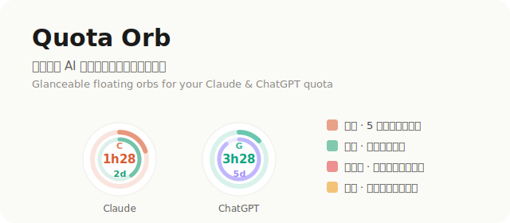

<div align="center">

# 🔮 Quota Orb

### 别再让花钱买的 Claude / ChatGPT 额度白白过期。

一个 macOS 桌面悬浮球，**实时**显示你的 AI 订阅额度——把不用就浪费的额度用起来，也不再干到一半突然撞限额。



[](https://github.com/xffighting/quota-orb)
[](https://github.com/xffighting/quota-orb)
[](LICENSE)
[](https://github.com/xffighting/quota-orb/pulls)

[English](README.md) · **中文**

</div>

---

## 💡 为什么做它

你开了 Claude Pro/Max、ChatGPT/Codex 订阅，但是：

- 额度每 **5 小时**、每 **周** 重置，**没用掉的就蒸发了** 💸；
- 或者正干在兴头上，**毫无预警地撞到限额**。

Quota Orb 把这两个窗口**常驻屏幕、颜色编码、一眼可见**。瞄一眼就知道：*现在该用还是该省，以及哪个模型还有余量。*

## ✨ 功能

- **每家一颗双环球** —— 外环 = 5 小时窗口，内环 = 周窗口。
- **两个倒计时摆在正中** —— 颜色与圆环对应，几点重置清清楚楚。
- **「用不完就浪费」提醒** —— 大量额度即将重置时球**呼吸变红**，用得太慢时变**琥珀**。别浪费你付过钱的额度。
- **点击直达** —— 单击球唤起/切换到对应应用（Claude.app / Codex）。
- **悬停看详情** —— 精确重置时间、已用百分比、一句话建议。
- **官方实时数据** —— **100% 本地读取**，**零额度消耗**。
- **双语** —— 按系统语言自动切换中 / 英。
- **开机自启**，随意拖动、记住位置。

## 🔒 隐私优先

这点很关键，因为工具要读你的登录态：

- 它**只读你自己机器上、你自己的本地登录态**（Claude 桌面版的钥匙串条目、Codex 的本地会话文件）。
- 它**不向任何地方发送任何东西**。没有服务器、没有埋点、不需要账号。
- 它**从不消耗额度** —— 读的是用量元数据和本地文件，不调用模型。
- 它**完全开源** —— 每一行都在这里，跑之前可以自己审。

## 🚀 安装

```bash
git clone https://github.com/xffighting/quota-orb.git
cd quota-orb
./install.sh
```

`install.sh` 会检查依赖、在**你自己机器上**编译（所以不会有 Gatekeeper「身份不明的开发者」拦截）、设好开机自启并启动。随时 `./uninstall.sh` 卸载。

**环境要求：** macOS · [Node.js](https://nodejs.org) · Xcode 命令行工具（`xcode-select --install`）

## 🧩 工作原理

| 球 | 数据源 | 说明 |
|-----|-------------|-------|
| **Claude** | Claude 桌面版登录态 → 官方用量接口 | 实时。需桌面版已登录；否则退回本地日志估算。 |
| **ChatGPT** | Codex CLI 写入本地会话文件的官方 `rate_limits` | 你上次跑 Codex 时的官方快照。 |

每个探针都是一小段可读脚本（`*-probe.mjs` + `lib/*.py`）。悬浮球本体是单个 AppKit 文件（`QuotaOrb.swift`）。新增一家约 20 行。

## 🗺️ 路线图 & 贡献

非常欢迎 PR，几个适合上手的：

- [x] **双语 UI（中 / 英）** —— 自动识别系统语言。✅
- [ ] 更多语言（日本語、Español…） —— 看 `QuotaOrb.swift` 里的 `L(...)` helper。
- [ ] 更多 provider（Gemini、MiniMax、Cursor…） —— 架构是 provider 可插拔的。
- [ ] 菜单栏模式，作为悬浮球之外的另一种形态。
- [ ] 用配置文件自定义阈值与刷新间隔。

发现 bug 或想加某家？[提个 issue](https://github.com/xffighting/quota-orb/issues)。

## 📄 许可

MIT —— 随便用。如果它帮你省下了额度，点个 ⭐ 就很感激了。

<div align="center">
<sub>献给见不得花钱买的额度白白过期的人。</sub>
</div>
